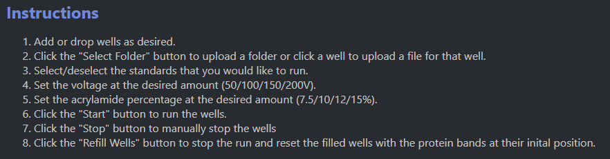

# JBioFramework Web Application 

[](http://protein-separation-sim.se.rit.edu/)

> The JBioFramework Web Application is a more efficient method of performing 1-Dimensional
> through the use of a browser and file selection in the format of FASTA files. This
> document will contain information regarding [Download and Installation](#download-and-installation),
> [Usage for Development](#usage-for-development), and [Testing Usage](#testing-usage) for the application.

## Project Sponsor


> [Dr. Paul Craig](mailto:pac8612@rit.edu) received his B.S. in Chemistry from Oral Roberts University
> in 1979, and his Ph.D. in Biological Chemistry from The University of Michigan in 1985. Following a
> post-doc at Henry Ford Hospital (biophysical chemistry of blood clotting; 1985-1988), he spent five
> years as an analytical biochemist at BioQuant, Inc., in Ann Arbor, Michigan before joining RIT in 1993.

---

# Download and Installation

```bash
git clone https://github.com/paulcraig/ProSep
cd ProSep
```

### VSCode Dev Container

This repository includes a Python 3.12 slim dev container. Install the **Dev Containers** extension in VSCode, open the command palette, and choose:

- **Dev Containers**: **Rebuild and Reopen in Container**
  or
- **Dev Containers**: **Reopen in Container**

### Manual Installation

```bash
python -m pip install -r requirements.txt
```

- On Windows, use `py` instead of python if `python` doesn't work.

### Pre-Commit Hooks

> This repository has several checks which run before approval is allowed.
> These are included by python's Pre-Commit. To install the hooks, run the following in your shell:

```bash
pre-commit install
```

This will install all the hooks. Any freshly committed files should have the hooks fix and apply.

### Software Requirements

- Python 3.7 or higher
- Node.js 20.11.0 or higher
- React 18.2.0 or higher

---

## Usage for Development

Navigate to the top level directory by typing in the command line

```bash
cd ProSep
```

<br/>

Launch the API server by typing in the command line:

```bash
uvicorn server:app --reload
```

Navigate to the jbio-app subdirectory by typing in the command line

```bash
cd frontend/jbio-app
```

Then install the npm files

```bash
npm install
```

<br/>

Launch the application by typing in the command line:

```bash
npm start
```

A browser will open with the URL: http://localhost:3000/

Press the **`1D Electrophoresis`** button on the left.

Follow the instructions listed beneath the simulation to load the desired FASTA files and begin the simulation:



### Tagging Policy

The server picks up changes via semantic versioning. As such, all tags must come
from the main branch and be tagged semantically.

For example: `v1.1.1` -> `v1.1.2`

### Testing Usage

- TODO

### Backend Guide

#### Author: Mack Leonard

Navigate to the top level directory by typing in the command line

```bash
cd ProSep
```

Then execute a test with

```bash
python -m unittest backend.Electro1DTests.ProteinTest
```

OR

Some IDEs have a built-in run function for files that can be executed. If you wish to do this, navigate to the ProteinTest.py or any other test file and click the run button.

<br/>

Analyze results from the tests being run and modify the test or method being tested if failed.

### API Guide:

- TODO

---

## Project Teams

- Fall 2025 to Spring 2026:

  - Coach:
    - [Mark Wilson](mailto:mwvse@rit.edu)
  - Developers:
    - Luke Knofczynski
    - Zachary Van Horn
    - Shreyas Gadwalker
    - Jacob Fey
    - Aditya Vikram
- Fall 2023 to Spring 2024:

  - Coach:
    - [Mark Wilson](mailto:mwvse@rit.edu)
  - Developers:
    - [Chase Amador](https://www.linkedin.com/in/chase-amador-54765b209/)
    - [Beck Anderson](https://www.linkedin.com/in/beck-anderson-se/)
    - [Landon Heatly](https://www.linkedin.com/in/landon-heatly-77a093175/)
    - [Mack Leonard](https://www.linkedin.com/in/mack-leonard/)
    - [Amr Mualla](https://www.linkedin.com/in/amrmualla/)
